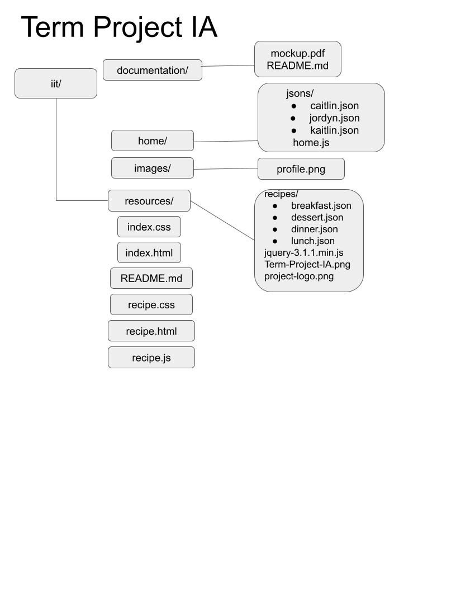

# ITWS1100-S24-team9

## Overview
Our project Recipe Rendezvous aims to allow users to receive recipes based upon the ingredients and items that they input. Users are asked for ingredients that they have as well as the option to select recipes for breakfast, lunch, dinner, or dessert. This project will take data from a database in order to generate these recipes for the user. This project will serve users who want to save money, preventing unnecessary grocery trips. It will serve a diverse range of users including professionals, those with culinary interest, money-conscious individuals, or anyone who is looking for creative, new recipes for ingredients that they already have on hand. This application differs from other applications because it gives recipes to users from a strict list of ingredients, in which other applications may give recipes just based on preference, not ingredients. This application saves users time and caters towards the user. Furthermore, the inspiration for this project was our passion for cooking and looking for new recipes.

## Goals
- To attend to the needs of users who want to save money (ex. college students, etc.) so they don’t have to make many grocery shopping trips. 
- Cater to user’s ingredient preferences (ex. allergies, etc.)
- Make sure food does not go to waste if it is expiring or spoiled.
- Create a user friendly app to allow cooking lovers to cook with ingredients already in their household. 

## Areas of Focus
<em>Primary Area of Focus: </em>

The primary area of focus of our project is to complete a project that targets all of our goals for this project. This entails building an application that takes in the inputs (ingredients, preferences, meal, etc.) of users and provides them with recipes based on this information. This app is expected to be a very user friendly app so that it is easy and fun to use for people regardless of their needs and draws in users by making it look pleasant to the eyes.

<em>Secondary Area of Focus: </em>

The secondary area of focus for our project will be the technical aspects of the project. This includes developing the algorithms needed to analyze the ingredients and generate recipes. This may include machine learning in order to interpret user input accurately. This focus also includes performance, where performance will come secondary to user experience. Another secondary area of focus will be the quality of the recipes that are outputted to the user. Recipes will be relevant, but also of high quality which will consider restrictions and preferences.

## Term Project IA

## Sources

Our recipes were sourced from this database of recipes and sorted to suit what we needed for this project

- https://github.com/dpapathanasiou/recipes 
