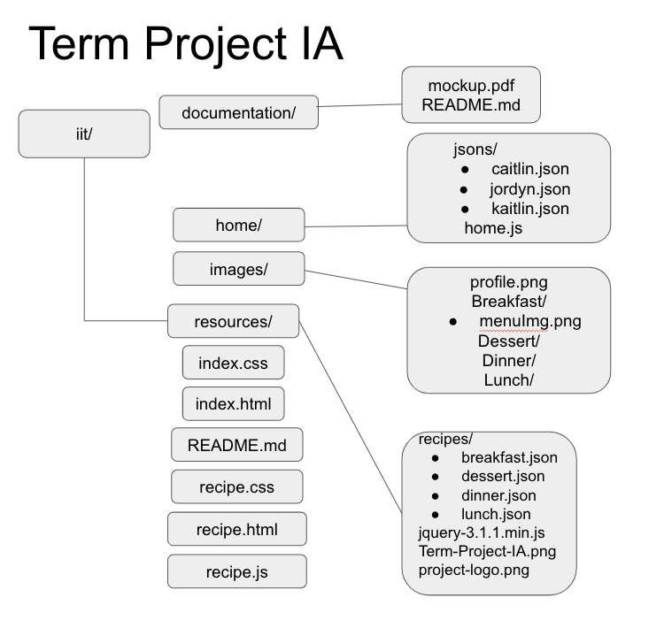

# ITWS1100-S24-team9

## Overview
Our project Recipe Rendezvous aims to allow users to receive random recipes based upon the desired meal that they select. Users are asked for which meal they want to generate a recipe for from breakfast, lunch, dinner, or dessert. This project will take data from a database in order to generate these recipes for the user. This project will serve users who want to save money, preventing unnecessary grocery trips. It will serve a diverse range of users including professionals, those with culinary interest, money-conscious individuals, or anyone who is looking for creative, new recipes for ingredients that they already have on hand. This application differs from other applications because it gives recipes to users from a strict list of ingredients, in which other applications may give recipes just based on preference, not ingredients. This application saves users time and caters towards the user. Furthermore, the inspiration for this project was our passion for cooking and looking for new recipes.

## Goals
- To attend to the needs of users who want to create fun, new recipes they have not seen before
- Cater to user’s meal preferences 
- Create a user friendly app to allow cooking lovers to cook with varying recipes

## Areas of Focus
<em>Primary Area of Focus: </em>

The primary area of focus of our project is Area 1: HTML, CSS, and graphics for  page layout and design. This app is expected to be a very user friendly app so that it is easy and fun to use for people regardless of their needs and draws in users by making it look pleasant to the eyes with a comprehensive color palatte, with easily accessible and clear buttons. 

<em>Secondary Area of Focus: </em>

The secondary area of focus for our project will be Area 3: Pull static data from a JSON data file. We created four separate JSON files to store our pre-selected recipes for each meal. These recipes were parsed using jQuery to display a randomly pulled recipe from the list of recipes. We also pulled data from a JSON file to display information for each developer on the home page using AJAX and jQuery.

## Term Project IA

## Sources

Our recipes were sourced from this database of recipes and sorted to suit what we needed for this project

- https://github.com/dpapathanasiou/recipes 

To learn jQuery, HTML, and CSS styling for our webpage.

- https://www.geeksforgeeks.org/
- https://stackoverflow.com/
- https://fonts.google.com/
-https://coder-coder.com/how-to-center-button-with-html-css/#:~:text=You%20can%20achieve%20this%20by,center%20them%20on%20the%20page.
- https://www.w3schools.com/css/css3_buttons.asp